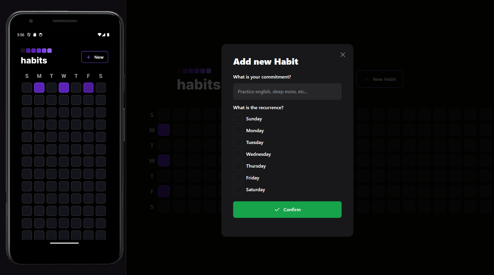

<h1 align="center">
    
</h1>

<br>

## 🧪 Tecnologies

This project was developed with the following technologies:

- [React Native](https://reactnative.dev/)
- [ReactJS](https://react.dev/)
- [NodeJS](https://nodejs.org/en)
- [Typescript](https://www.typescriptlang.org/)
- [Fastify](https://www.fastify.io/)
- [Zod](https://zod.dev/)
- [Prisma](https://www.prisma.io/)
- [Expo](https://expo.dev/)
- [Tailwind](https://tailwindcss.com/)
- [NativeWind](https://nativewind.dev/)

## 🚀 Running the project

Clone the repo

```bash
$ git clone https://github.com/daniilomello/habits-app
```

To run the project, follow the steps below:

```bash
# Install the dependencies
$ cd habits-app/server
$ yarn
```

Start the Fastify server
```bash
$ yarn dev
# Server wil be running on http://localhost:3001
```

Start the React app
```bash
# Access the React app folder
$ cd habits-app/web

# Install the React Vite dependencies
$ yarn

# Run the application
$ yarn dev
# App will be running on http://127.0.0.1:5173/
```

Start the React Native mobile app
```bash
# Access the mobile app folder
$ cd habits-app/mobile

# Install the project dependencies
$ yarn

# Run the expo
$ yarn expo start
```

## 📝 License

This project is licensed under the MIT.

---

Build with 💜 by Danilo Mello 👋🏻
